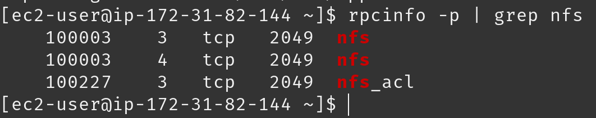
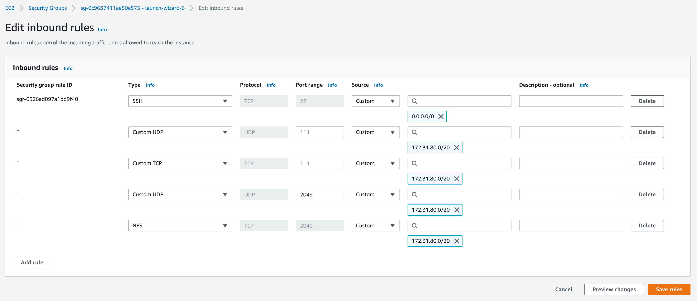
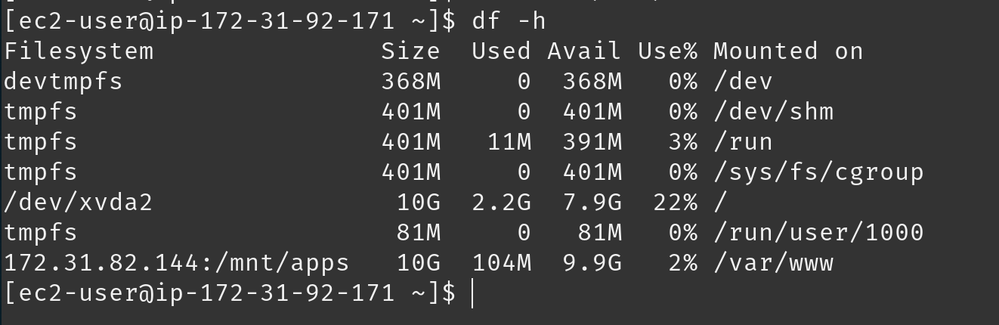
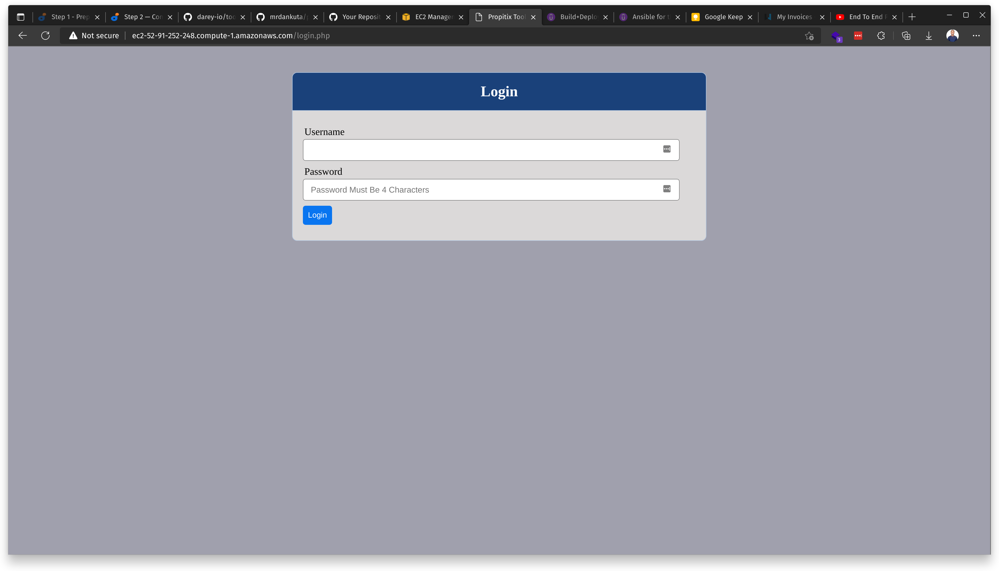
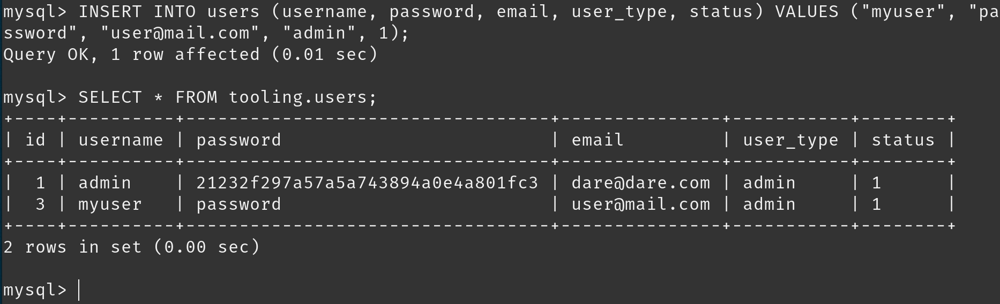
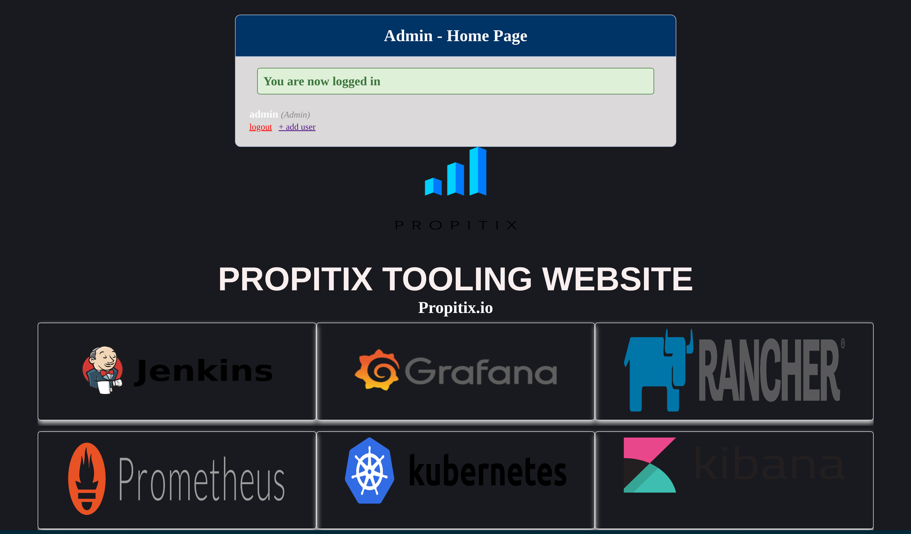

# Project 7 - Tooling Website Solution

---

## Step 1 - Setup NFS Server

- Launch a new EC2 instance `nfs-server`
- Create 3 Volumes of 10GB each within the same Availability Zone as the previously created instance
- Attach each volume to the `nfs-server` instance
- Connect to `nfs-server` instance via terminal
- Inspect devices by using the `lsblk` command
- Create a single partition on each attached disks using the `gdisk` utility:
    ```
    sudo gdisk /dev/xvd[f,g,h]
    ```
- Use `lsblk` to view devices and new partitions
- Install `lvm2` package:
    ```
    sudo yum install lvm2
    ```
- Check for available partitions:
    ```
    sudo lvmdiskscan
    ```
- Mark each partition previously created as physical volumes to be used by `lvm`:
    ```
    sudo pvcreate /dev/xvdf1
    sudo pvcreate /dev/xvdg1
    sudo pvcreate /dev/xvdh1
    ```
- Use the `pvs` command to verify and view newly created physical volumes:
    ```
    sudo pvs
    ```
- Add all 3 physical volumes to a volume group called `nfs-vg`:
    ```
    sudo vgcreate webdata-vg /dev/xvdf1 /dev/xvdg1 /dev/xvdh1
    ```
- Use the `vgs` command to verify and view newly created volume group:
    ```
    sudo vgs
    ```
- Create three logical volumes using the `lvcreate` utility. Create `lv-apps` (to be used by webservers), `lv-logs` (to be used by webserver logs), and `lv-opt` (to be used by Jenkins server).
    ```
    sudo lvcreate -n lv-apps -L 10G nfs-vg
    sudo lvcreate -n lv-logs -L 10G nfs-vg
    sudo lvcreate -n lv-opt -L 9G nfs-vg
    ```
- Use the `lvs` command to verify and view newly created logical volumes:
    ```
    sudo lvs
    ```
- Verify entire setup:
    ```
    sudo vgdisplay -v #view complete setup - VG, PV, and LV
    sudo lsblk
    ```
- Format logical volumes with `xfs` filesystem:
    ```
    sudo mkfs -t xfs /dev/nfs-vg/lv-apps
    sudo mkfs -t xfs /dev/nfs-vg/lv-logs
    sudo mkfs -t xfs /dev/nfs-vg/lv-opt
    ```
    
- Create directories for logical volumes mount points:
    ```
    sudo mkdir /mnt/apps
    sudo mkdir /mnt/logs
    sudo mkdir /mnt/opt
    ```
- Mount `lv-apps` on `/mnt/apps`, `lv-logs` on `/mnt/logs`, and `lv-opt` on `/mnt/opt`:
    ```
    sudo mount /dev/nfs-vg/lv-apps /mnt/apps/
    sudo mount /dev/nfs-vg/lv-logs /mnt/logs/
    sudo mount /dev/nfs-vg/lv-opt /mnt/opt/
    ```
- Install NFS server:
    ```
    sudo yum -y update
    sudo yum install nfs-utils -y
    ```
- Configure NFS server to start on reboot and ensure it is running:
    ```
    sudo systemctl start nfs-server.service
    sudo systemctl enable nfs-server.service
    sudo systemctl status nfs-server.service
    ```
- Configure permissions to allow Web servers to read, write and execute files on NFS:
    ```
    sudo chown -R nobody: /mnt/apps
    sudo chown -R nobody: /mnt/logs
    sudo chown -R nobody: /mnt/opt

    sudo chmod -R 777 /mnt/apps
    sudo chmod -R 777 /mnt/logs
    sudo chmod -R 777 /mnt/opt

    sudo systemctl restart nfs-server.service
    ```
- Configure access to NFS for only clients within the same subnet by editing `/etc/exports`:
    ```
    sudo vi /etc/exports
    ```
- Insert the following code:
    ```
    /mnt/apps 172.31.80.0/20(rw,sync,no_all_squash,no_root_squash)
    /mnt/logs 172.31.80.0/20(rw,sync,no_all_squash,no_root_squash)
    /mnt/opt 172.31.80.0/20(rw,sync,no_all_squash,no_root_squash)
    ```
- Export:
    ```
    sudo exportfs -arv
    ```
    
- Check port used by NFS:
    ```
    rpcinfo -p | grep nfs
    ```
    
- In EC2, open ports `TCP 111`, `UDP 111`, and `UDP 2049` to allow NFS server to be accessible from client.
    


## Configure Database Server

- Update `apt` repository:
    ```
    sudo apt update
    ```
- Install MySQL Server Software: 
    ```
    sudo apt install mysql-server
    ``` 
- Open port `3306` on `dbserver` by adding inbound rule in EC2. Allow access only to `172.31.80.0/20`.
- Set root user password: 
    ```
    ALTER USER 'root'@'localhost' IDENTIFIED WITH mysql_native_password BY 'DeFPassyWord_1';
    ```
- Exit MySQL Shell: 
    ```
    exit
    ```
- Remove insecure default setting with pre-installed security script. Start script: 
    ```
    sudo mysql_secure_installation
    ```
- Follow and respond to prompts to setup `root` password & other preferences.
- Login with `-p` flag to prompt for password and verify everything works well.
    ```
    sudo mysql -p
    ```
- Create a new role:
    ```
    CREATE ROLE 'webservers';
    ```
- Create a new database:
    ```
    CREATE DATABASE 'tooling';
    ```
- Assign privileges to `tooling` for `webservers` role:
    ```
    GRANT ALL PRIVILEGES ON tooling.* TO 'webservers';
    FLUSH PRIVILEGES;
    ```
- Create new user and assign `webservers` role:
    ```
    CREATE USER IF NOT EXISTS 'webaccess'@'172.31.80.0/20' IDENTIFIED WITH mysql_native_password BY 'mypass001' DEFAULT ROLE webservers;
    ```
- Edit the `mysqld.cnf` to configure MySQL to allow incoming remote connections:
    ```
    sudo vi /etc/mysql/mysql.conf.d/mysqld.cnf
    ```
- Find and change the `bind-address` value from `127.0.0.1` to `0.0.0.0`


## Configure 3 Webservers

- Launch 3 new EC2 instances named `webserver1`, `webserver2`, and `webserver3`
### On each of the webservers:
- Install NFS client:
    ```
    sudo yum install nfs-utils nfs4-acl-tools -y
    ```
- Mount `/var/www/` and target NFS server's exports for apps:
    ```
    sudo mkdir /var/www
    sudo mount -t nfs -o rw,nosuid 172.31.82.144:/mnt/apps /var/www
    ```
- Verify successful mount of NFS on `/var/www/` with `df -h`
    
- Edit `fstab` to ensure mount persists after reboot:
    ```
    sudo vi /etc/fstab
    ```
- Add the following:
    ```
    172.31.82.144:/mnt/apps /var/www nfs defaults 0 0
    ```
- Add [Remi's Repository](http://www.servermom.org/how-to-enable-remi-repo-on-centos-7-6-and-5/2790/) with Apache and PHP:
    ```
    sudo yum install httpd -y
    sudo dnf install https://dl.fedoraproject.org/pub/epel/epel-release-latest-8.noarch.rpm
    sudo dnf install dnf-utils http://rpms.remirepo.net/enterprise/remi-release-8.rpm
    sudo dnf module reset php
    sudo dnf module enable php:remi-7.4
    sudo dnf install php php-opcache php-gd php-curl php-mysqlnd
    sudo systemctl start php-fpm
    sudo systemctl enable php-fpm
    sudo setsebool -P httpd_execmem 1
    ```

*Verify that Apache files and directories are available on the Web Server in `/var/www` and also on the NFS server in `/mnt/apps`. If you see the same files – it means NFS is mounted correctly. You can try to create a new file touch `test.txt` from one server and check if the same file is accessible from other Web Servers.*

- Mount `/var/log/httpd` and target NFS server's exports for logs:
    ```
    sudo mount -t nfs -o rw,nosuid 172.31.82.144:/mnt/logs /var/log/httpd
    ```
- Verify successful mount of NFS with `df -h`
- Edit `fstab` to ensure mount persists after reboot:
    ```
    sudo vi /etc/fstab
    ```
- Add the following:
    ```
    172.31.82.144:/mnt/logs /var/log/httpd nfs defaults 0 0
    ```

### On one webserver (anyone of the 3):
- Clone the `mrdankuta/pbl7-tooling` repo (*forked from `darey-io/tooling`*) and copy all contents of the `html` folder into `/var/www/html/`
- In EC2 open `port 80` on the webservers
    
- Connect app to database by inserting access details in `/var/www/html/functions.php`
- Install MYSQL client on webserver:
    ```
    sudo yum install mysql
    ```
- Import the `tooling-db.sql` file in `pb7-tooling` folder into the `tooling` database:
    ```
    mysql -h 172.31.81.210 -u webaccess -p tooling < tooling-db.sql
    ```
- Connect remotely to the database server and create a new user:
    ```
    mysql -h 172.31.81.210 -u webaccess -p

    USE tooling;

    INSERT INTO users (username, password, email, user_type, status) VALUES ("myuser3", "pass", "userer@mail.com", "admin", 1);
    ```
    
- Open website on `webserver-ip` and login
    